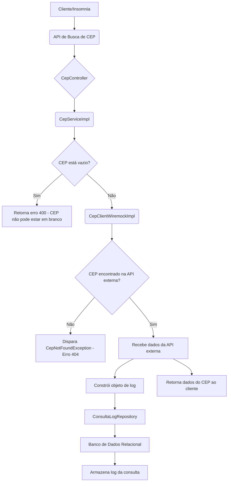

# Solutis  - Teste Desenvolvedor Backend - Júnior

## Visão Geral

Este projeto é uma aplicação Java Spring Boot que permite buscar informações de CEP através de uma API externa (mockada) e persistir o histórico de consultas em um banco de dados, seguindo as boas práticas de desenvolvimento e garantindo o correto funcionamento da aplicação.

## Desenho da Solução

O diagrama abaixo ilustra a arquitetura da aplicação e o fluxo de dados:




## Explicação do Fluxo:

1 - Um **Cliente** (como Postman ou uma aplicação web) envia uma requisição HTTP para a **API de Busca de CEP**.

2 - O `CepController` recebe a requisição, validando o CEP e delegando a lógica de negócio para o `CepService`.

3 - O `CepService` executa duas operações principais:

 - Invoca a **API Externa de CEP** (que neste projeto é **mockada** com WireMock) para obter os dados do endereço.

 - Utiliza o `CepLogRepository` para persistir os detalhes da consulta (CEP, data/hora, dados retornados) em um **Banco de Dados Relacional**.

4 - Após coletar os dados e registrar o log, o `CepService` retorna a informação de endereço para o `CepController`, que a envia de volta ao cliente.


## Tecnologias Utilizadas

- **Java 21**: Linguagem de programação principal.

- **Spring Boot 3.x**: Framework para desenvolvimento rápido de APIs REST.

- **Spring Data JPA / Hibernate**: Para persistência de dados em banco de dados relacional.

- **MySQL**: Banco de dados relacional para armazenamento dos logs.

- **WireMock**: Ferramenta para mockar a API externa de CEP, simulando respostas e erros.

- **Maven**: Ferramenta de gerenciamento de dependências e build.

- **Lombok**

## Arquitetura

O projeto segue uma arquitetura em camadas:

- **Controller Layer**: Esta camada é a porta de entrada da sua aplicação. Ela lida diretamente com as requisições HTTP recebidas do cliente.

    -  `CepController`: Responsável por receber as requisições de busca de CEP (ex: GET /api/v1/ceps/{cep}). Ele valida os parâmetros de entrada e delega a lógica de negócio para a camada de serviço. Sua função principal é intermediar a comunicação entre o cliente e o serviço.

     - `ConsultaLogController`: Gerencia as requisições relacionadas aos logs de consulta, permitindo, por exemplo, visualizar o histórico de buscas de CEP.

- **Service Layer**: A camada de serviço contém a lógica de negócio principal da sua aplicação. Ela orquestra as operações, utilizando recursos de outras camadas (como o cliente de API externa e o repositório) para cumprir suas responsabilidades.

     - `CepService` (interface): Define o contrato para as operações de negócio relacionadas ao CEP. Isso permite que você tenha múltiplas implementações se necessário, sem afetar o código que as utiliza (princípio OCP).

     - `CepServiceImpl` (implementação): É a implementação concreta da interface CepService. Aqui, você encontra a lógica para chamar a API externa de CEP (através do CepClient), processar a resposta e registrar a consulta no banco de dados (usando o `ConsultaLogRepository`). Esta classe centraliza as regras de negócio para a busca e log do CEP.

    
- **Client Layer**: Esta é uma camada específica para lidar com a comunicação com serviços externos à sua aplicação.

     - `CepClient` (interface): Define o contrato para a comunicação com a API externa de CEP.

     - `CepClientWiremockImpl`: É a implementação do CepClient que interage especificamente com o serviço mockado pelo WireMock. Esta separação permite que, futuramente, você possa ter outras implementações para diferentes APIs de CEP reais (ex: `CepClientViaCepImpl`), sem modificar a camada de serviço.

- **Model Layer**: A camada de modelo define as estruturas de dados e as entidades de negócio da sua aplicação.

     - `ConsultaLog`: Representa a entidade que será persistida no banco de dados. Ela contém os campos necessários para registrar cada consulta de CEP, como o CEP consultado, a data/hora da consulta e os dados retornados da API externa.

- **Repository Layer**: Esta camada é responsável pela interação com o banco de dados. Ela abstrai os detalhes de persistência, permitindo que a camada de serviço trabalhe com objetos de domínio sem se preocupar com a forma como eles são armazenados.

     - `ConsultaLogRepository`: Interface que estende funcionalidades do Spring Data JPA (ou similar). Ela fornece métodos para salvar, buscar e gerenciar as entidades ConsultaLog no banco de dados, facilitando a persistência do histórico de consultas.

- **Config Layer**: Esta camada contém as classes responsáveis por configurações diversas da aplicação, como conexão com banco de dados, beans do Spring, etc.

     - `AppConfig`: Pode conter configurações gerais da aplicação, como a criação de beans para o RestTemplate ou WebClient usado pelo `CepClientWiremockImpl`.

     - DBConfig: Contém configurações específicas relacionadas à conexão e comportamento do banco de dados.

- **DTO Layer**: Os DTOs (Data Transfer Objects) são objetos simples usados para transferir dados entre as diferentes camadas da aplicação ou entre a aplicação e o cliente externo. Eles servem para formatar os dados de forma específica para cada necessidade.

     - `CepResponseDTO`: Objeto usado para formatar a resposta enviada de volta ao cliente após uma busca de CEP bem-sucedida, contendo apenas os campos relevantes que o cliente precisa ver.

     - `ConsultaLogDTO`: Objeto usado para formatar os dados de log quando, por exemplo, o `ConsultaLogController` precisar retornar o histórico de consultas para o cliente.

- **Exception Layer**: Esta camada é dedicada ao tratamento de erros e à definição de exceções customizadas da aplicação.

     - `CampoVazioException`: Exceção customizada lançada quando um campo obrigatório está vazio.

     - `CepNotFoundException`: Exceção customizada lançada quando um CEP não é encontrado pela API externa ou pelo mock.

     - `CepExceptionHandler`: Handler específico para tratar exceções relacionadas a CEPs.

     - `GlobalExceptionHandler`: Um centralizador para lidar com exceções de forma global em toda a aplicação, garantindo que as respostas de erro sejam padronizadas e informativas para o cliente.


## Endpoints

<p align="center"> <image title="" aria-hidden="true" src="assets/images/screenshot_swagger.png" /></p>
<p align="center"> Swuagger </p>

### Buscar CEP

```
GET /api/v1/ceps/{cep}
```

Este endpoint recebe os dados do usuário e realiza o cadastro, aplicando as validações necessárias.

## Exemplos de Requisição

### CEP Válido:

```json
curl -v http://localhost:8081/api/cep/01001-000
```

<p align="center"> <image title="" aria-hidden="true" src="assets/images/screenshot_cep_found.png" /></p>
<p align="center"> CEP Válido </p>

### CEP Inválido (para ver o tratamento de erro e o log):

```json
curl -v http://localhost:8081/api/cep/eofj8-60p
```

<p align="center"> <image title="" aria-hidden="true" src="assets/images/screenshot_cep_not_found.png" /></p>
<p align="center"> CEP Inválido </p>

### Parâmetro Vazio (para ver o tratamento de erro):

```json
curl -v http://localhost:8081/api/cep
```

<p align="center"> <image title="" aria-hidden="true" src="assets/images/screenshot_empty_fild.png" /></p>
<p align="center"> Campo Vazio </p>


### Listagem dos Logs:

```json
curl -v http://localhost:8081/logs
```

<p align="center"> <image title="" aria-hidden="true" src="assets/images/screenshot_cep_get_all.png" /></p>
<p align="center"> Listagem dos Logs salvos no banco </p>


## Como Rodar a Aplicação

1. Clone o repositório
2. Dentro da pasta assets execute o comando `java -jar wiremock-standalone-3.4.2.jar --port 8089 --verbose` para rodar a aplicação WireMock

<p align="center"> <image title="" aria-hidden="true" src="assets/images/screenshot_wiremock.png" /></p>
<p align="center"> WireMock </p>

3. Crie um arquivo .env dentro da pasta `src/main/resource` com as variáveis e os valores locais: 
**DATABASE_URL**(URL do banco local)
**DATABASE_USERNAME**(Usuário do banco local)
**DATABASE_PASSWORD**(Senha do banco local)
**DATABASE_DRIVER**(Driver do banco local)
**DATABASE_HIBERNATE_DDL**(DLL do banco local)
**APP_PORT**(8080)
4. Execute o comando: `./mvnw spring-boot:run`

<p align="center"> <image title="" aria-hidden="true" src="assets/images/screenshot_maven.png" /></p>
<p align="center"> Maven </p>

5. O servidor estará disponível em `http://localhost:8080/docs`


## Logs salvos no banco local

<p align="center"> <image title="" aria-hidden="true" src="assets/images/screenshot_db.png" /></p>
<p align="center"> Banco de dados local </p>

## Considerações Finais

Este projeto foi desenvolvido como parte do desafio backend da Solutis, demonstrando a capacidade de construir uma aplicação Java Spring Boot completa, integrando serviços externos (mesmo que mockados), persistência de dados e aplicando boas práticas de desenvolvimento como SOLID,  tratamento de exceções e arquitetura em camadas.